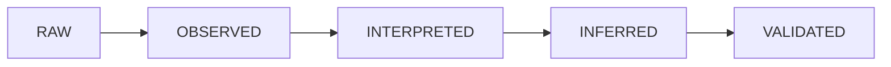
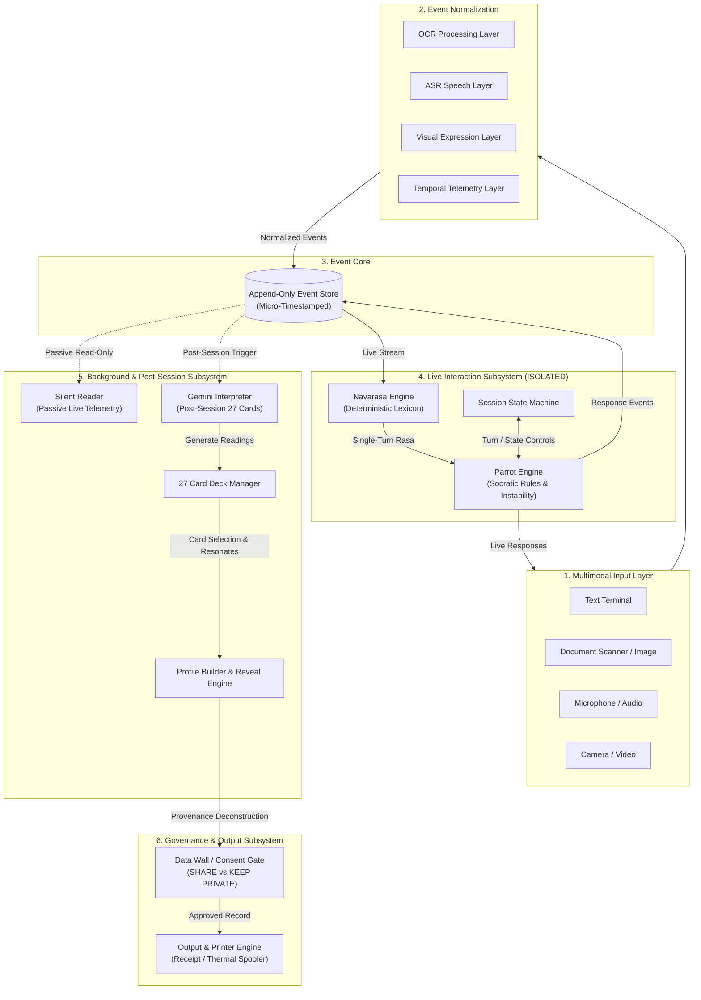

# FREEING THE PARROT 2.0 (FTP 2.0)
## System Architecture & Subsystem Boundaries

> *"The machine doesn't know you. It just knows how to sound like it does."*

---

## 1. Architectural Philosophy & Core Axiom

Freeing the Parrot 2.0 (FTP 2.0) is an interactive physical-digital installation that exposes the psychological mechanics of artificial empathy, subjective validation (the Forer–Barnum effect), and automated categorization.

### The Non-Negotiable Core Principle: "The Parrot Remains Ignorant"

The live conversational system (the **Parrot**) must remain fundamentally isolated from all accumulated profiling, deep telemetry, and post-session intelligence.

```
┌─────────────────────────────────────────────────────────────────────────────┐
│                          LIVE PARROT INTERACTION                            │
│  - Receives ONLY: Current turn input + immediate turn history (N turns)    │
│  - Receives ONLY: Single-turn deterministic Navarasa classification        │
│  - IS STRICTLY ISOLATED FROM: Silent Reader logs, Gemini synthesis,        │
│    the 27 cards, user psychometric profiles, and long-term history.         │
└─────────────────────────────────────────────────────────────────────────────┘
                                      │
                         NO FEEDBACK  │  ONE-WAY READ-ONLY
                            LOOP      │  EVENT STREAM
                                      ▼
┌─────────────────────────────────────────────────────────────────────────────┐
│                BACKGROUND ANALYTICS & POST-SESSION REVEAL                   │
│  - Silent Reader: Passively collects temporal, biometric & text telemetry   │
│  - Gemini Interpreter: Asynchronously generates 27 Kili Josiyam cards       │
│  - Profile Builder / Reveal: Explains how the illusion was generated       │
└─────────────────────────────────────────────────────────────────────────────┘
```

**Artistic Rationale:** If the live Parrot adapted to or utilized the participant's background profile, it would become an authentic recommendation agent. Keeping the Parrot blind and rule-driven ensures that any feeling of deep personal resonance experienced by the participant is recognized in retrospect as their own subjective projection.

---

## 2. Data Provenance Hierarchy

Every data point generated within FTP 2.0 strictly belongs to one of five explicit provenance tiers. Downstream systems must never elevate a data point's status without passing through the formal processing pipeline.



1. **`RAW` (Level 0):** Unprocessed multi-modal sensory inputs directly from physical or digital interfaces (e.g., raw scan image bytes, microphone WAV buffer, webcam video frames, raw keystroke events).
2. **`OBSERVED` (Level 1):** Directly measurable, objective computational metrics extracted from raw signals without semantic speculation (e.g., OCR character strings, ASR transcripts, facial landmark coordinates, inter-keystroke latencies, message submission timestamps).
3. **`INTERPRETED` (Level 2):** Deterministic or rule-based semantic mapping applied to observed data (e.g., 9-Rasa lexicon matches, VADER sentiment scores, profanity/health regex detections, grammatical mood detection).
4. **`INFERRED` (Level 3):** Probabilistic, qualitative, or heuristic syntheses generated by machine learning models or Gemini (e.g., 27 qualitative fortune readings, behavioral hesitation profiles, projected cognitive style). **Must always preserve explicit evidence, confidence scores, and alternative interpretations.**
5. **`VALIDATED` (Level 4):** Explicit participant feedback asserting personal resonance. **Architectural Invariant:** `VALIDATED` means *only* that the participant pressed the `"RESONATES"` button. It **never** denotes objective truth, scientific validity, or psychological diagnosis.

---

## 3. Subsystem Breakdown & Boundary Definitions



### 3.1 Multimodal Input Manager (`input_manager/`)
* **Role:** Ingests raw streams across Text, Image, Audio, and Video.
* **Separation of Concerns:** Does not perform semantic analysis. Dispatches raw data to specialized processing workers:
  * `OCR Layer`: Grayscale thresholding, grid removal, multi-variant Tesseract extraction.
  * `ASR Layer`: Acoustic speech-to-text transcription.
  * `Expression Layer`: Visual frame landmark and motion analysis.
  * `Temporal Telemetry Layer`: Millisecond-level interaction timings.
* **Output:** Publishes strictly formatted `RAW` and `OBSERVED` events to the Event Store.

### 3.2 Event Store & Bus (`event_store/`)
* **Role:** Append-only, microsecond-timestamped sequence of interaction events.
* **Guarantees:** Immutability, strict chronological ordering, cross-modality synchronization.
* **Access Control:** The live Parrot engine has no read access to the Event Store history beyond the immediate active conversation window.

### 3.3 Navarasa Engine (`navarasa/`)
* **Role:** Deterministic emotional classification layer.
* **Preservation:** Directly preserves the FTP 1.0 `navarasa_engine.py` implementation:
  * 9 Rasas (*Shringara, Hasya, Karuna, Raudra, Veera, Bhayanaka, Bibhatsa, Adbhuta, Shanta*).
  * Priority lexicon matching, negation detection, intensity scoring, and VADER sentiment.
* **Constraint:** Operates purely turn-by-turn. Maintains no cross-turn memory or participant profiling.

### 3.4 Live Parrot Engine (`parrot_engine/`)
* **Role:** The performative interlocutor. Implements Socratic questioning, conversational friction, and the gradual instability curve.
* **Behavioral Contract:**
  * **Trust Window (Turns 1–3):** 100% apparent understanding guarantee.
  * **Gradual Instability (Turn 4+):** Probabilistic instability curve ($P(\text{unstable}) = \min(0.70, 0.08 + (\text{turn} - 4) \times 0.055)$). 30% recovery chance retained permanently.
  * **Intervention Gates:** Health abort gate, expletive peck intervention, oracle/validation deflection.
* **Isolation Guarantee:** The Parrot Engine process memory contains *only* the current turn input, the immediate turn counter, and the active session ID.

### 3.5 Silent Reader (`silent_reader/`)
* **Role:** Real-time passive telemetry listener. Runs alongside the live conversation without blocking or influencing the Parrot.
* **Observations:** Monitors typing cadence, response latencies, revision counts, lexical density, sentiment trajectories, and pause durations.
* **Output:** Writes `OBSERVED` telemetry packets to the Event Store for post-session consumption.

### 3.6 Gemini Post-Session Interpreter & 27-Card Deck (`gemini_interpreter/`, `card_generator/`)
* **Role:** Asynchronous post-session qualitative analysis triggered *only* when the participant concludes the session (`"I AM DONE!"`).
* **The 27 Cards Architecture:**
  * Generates exactly **27 distinct, qualitative, astrology/Kili Josiyam-style fortune cards** rooted in the session's observed telemetry and linguistic choices.
  * **No Rigid Triads:** Cards are *not* forced into Navarasa triads. Navarasa is merely one signal among many (alongside temporal pauses, lexical friction, conversational length, sentiment volatility).
  * **Reading Aesthetic:** Cards must be resonant, evocative, and poetic character archetypes (e.g., *"The Keeper of Deferred Answers"*).
  * **No Analytical Spoilers:** Initial cards must **never** contain system diagnostics or spoilers (e.g., *"You said X so the system matched Y"*).
  * **Interaction:** Participant selects cards and flags them with **`"RESONATES"`** (not "true" or "accurate").

### 3.7 Profile Builder & Data Journey Reveal (`profile_builder/`, `reveal_engine/`)
* **Role:** The deconstruction stage. Activates *after* card selection.
* **Function:** Reveals the internal mechanical scaffolding behind the readings:
  * Maps the participant's selected cards back to exact raw inputs, keystroke pauses, Navarasa matches, and Barnum-effect heuristics.
  * Explicitly deconstructs the illusion of empathy, demonstrating how general statements and pattern-matching provoked personal meaning.

### 3.8 Consent & Data Wall (`data_wall/`)
* **Role:** Explicit, sovereign data governance gate separating data retention/sharing from physical output.
* **Options:**
  * **`SHARE`:** Explicit consent to archive anonymized session telemetry for public exhibition or research. PII and raw biometric data are stripped.
  * **`KEEP PRIVATE`:** Immediate hard purge of all session events and database entries following session completion.
* **Independence:** Printing/output never implies consent to data sharing.

### 3.9 Output & Printer Engine (`output_engine/`)
* **Role:** Generates the physical thermal receipt (POS58 ESC/POS) or digital Mirror Report.
* **Preservation:** Preserves 32-character wrapping (`LINE_WIDTH = 32`), token telemetry estimation ($\text{characters} / 4$), and project disclaimers:
  > *"It is better to be Homo Sapiens than Robo Sapiens."*  
  > *"The machine can reflect. You still have to think."*

---

## 4. Subsystem Isolation & Anti-Patterns

| Forbidden Anti-Pattern | Architectural Mitigation |
| :--- | :--- |
| **Parrot Profile Ingestion**<br/>(Live Parrot accessing Silent Reader or Gemini profile data) | **Strict Context Isolation:** `parrot_engine` API payload allows only `turn_text`, `turn_index`, and `navarasa_result`. No shared database access. |
| **Premature Reveal in Card Text**<br/>(Cards explaining system rules before the reveal phase) | **Schema Invariant:** The card generation prompt and JSON schema enforce poetic/archetypal text; analytical explanations exist only in the separate `reveal_schema`. |
| **Validation as Truth**<br/>(System claiming participant validation proves a personality trait) | **Provenance Restriction:** Participant feedback is strictly typed as `VALIDATED_RESONANCE`, mathematically isolated from ground truth assertions. |
| **Coupled Output & Consent**<br/>(Printing a receipt automatically saving session data to cloud/disk) | **Orthogonal Pipelines:** `output_engine` executes purely in-memory rendering. `data_wall` controls persistent storage independently. |
