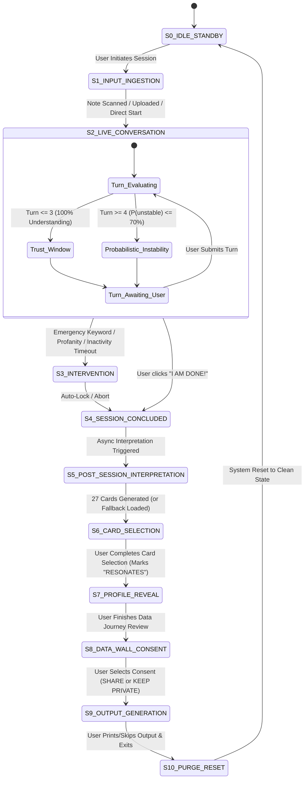

# FREEING THE PARROT 2.0 (FTP 2.0)
## Formal State Machine & Lifecycle Specification

> *"State transitions are sovereign to the participant and deterministic guards. AI content never controls the state machine."*

---

## 1. State Machine Invariants & Principles

1. **Deterministic Transition Authority:** State transitions are governed **exclusively** by deterministic user actions (e.g., button clicks, typed submissions) and programmatic guards (e.g., timeout timers, regex pattern matches).
2. **AI Content Isolation:** AI model outputs (whether from the Parrot, Silent Reader, or Gemini) **must never trigger state transitions directly**. They generate payloads within states; they do not dictate the flow of time or state.
3. **Graceful Degradation:** If any post-session model or hardware call fails, the state machine transitions to deterministic fallback states without trapping the participant.
4. **Explicit Consent Isolation:** Output generation (printing / downloading) is orthogonal to data retention consent. The state machine enforces separate steps for both.

---

## 2. Participant-Facing State Diagram

---

## 3. Comprehensive State & Transition Definitions

### S0: `IDLE_STANDBY`
* **Description:** Public-facing idle terminal. No active session exists.
* **Entry Action:** Clear session memory; verify database connection and scanner readiness.
* **Exit Action:** Generate unique `session_id` (UUIDv4); initialize empty event buffer.
* **Transitions:**
  * $\rightarrow$ `S1_INPUT_INGESTION` on Event `EVT_START_EXPERIENCE`.

---

### S1: `INPUT_INGESTION`
* **Description:** Participant feeds initial document (handwritten note), submits audio, or bypasses to direct terminal entry.
* **Active Components:** `input_manager` (OCR / ASR / Camera).
* **Guards:** Input file valid, non-empty text, or explicit user bypass.
* **Transitions:**
  * $\rightarrow$ `S2_LIVE_CONVERSATION` on Event `EVT_INPUT_NORMALIZED` or `EVT_INPUT_BYPASSED`.
  * $\rightarrow$ `S0_IDLE_STANDBY` on Event `EVT_TIMEOUT_IDLE` (60s inactivity).

---

### S2: `LIVE_CONVERSATION`
* **Description:** Interactive Socratic loop between participant and the live Parrot.
* **Sub-States & Internal Rules:**
  * **Turn 1 to 3 (Trust Window):** System guarantees apparent understanding (`mode = "understanding"`).
  * **Turn 4+ (Gradual Instability):** Evaluates instability probability ($P = \min(0.70, 0.08 + (\text{turn} - 4) \times 0.055)$). Selects randomly among Socratic challenge, roast, absurdity, memory glitch, or recovered understanding.
  * **Silent Reader (Concurrent):** Passively captures keystroke latency, temporal gaps, and sentiment trajectories to Event Store.
* **Transitions:**
  * $\rightarrow$ `S3_INTERVENTION` on Event `EVT_HEALTH_DETECTED`, `EVT_PROFANITY_DETECTED`, or `EVT_SILENCE_TIMEOUT` (10s threshold).
  * $\rightarrow$ `S4_SESSION_CONCLUDED` on Event `EVT_USER_DONE` (Participant clicks `"I AM DONE!"`).

---

### S3: `BEHAVIORAL_INTERVENTION`
* **Description:** Autonomous safety or behavioral response execution.
* **Actions by Trigger:**
  * **Health Trigger:** Refuse diagnosis, display medical boundary, lock session.
  * **Profanity Trigger:** Execute `"THE PARROT JUST PECKED YOUR HAND"`, trigger immediate receipt print, lock session.
  * **Silence Trigger:** Display timeout prompt; escalate to shutdown if unacknowledged.
* **Transitions:**
  * $\rightarrow$ `S4_SESSION_CONCLUDED` immediately upon intervention delivery.

---

### S4: `SESSION_CONCLUDED`
* **Description:** Conversation is irrevocably locked. Parrot response engine is permanently disabled for this session.
* **Entry Action:** Lock `messages` list; write `EVT_SESSION_LOCKED` to Event Store.
* **Transitions:**
  * $\rightarrow$ `S5_POST_SESSION_INTERPRETATION` automatically on completion of session lock.

---

### S5: `POST_SESSION_INTERPRETATION`
* **Description:** Asynchronous synthesis phase. Background interpreter processes event history.
* **Active Components:** `gemini_interpreter`, `card_generator`.
* **Execution Contract:**
  * Gemini receives full interaction event history + Silent Reader telemetry.
  * Generates exactly **27 distinct, qualitative, astrology/Kili Josiyam-style fortune cards**.
  * Cards are poetic and archetypal; they contain **no analytical spoilers**.
* **Failure Recovery Guard:** If API fails or exceeds 8000ms timeout, load deterministic 27-card baseline deck derived from detected Navarasa profile.
* **Transitions:**
  * $\rightarrow$ `S6_CARD_SELECTION` on Event `EVT_CARDS_READY`.

---

### S6: `CARD_SELECTION`
* **Description:** Participant is presented with the 27 generated reading cards.
* **Interaction Contract:**
  * Participant browses cards and selects those that evoke recognition.
  * Participant marks cards with the action: **`"RESONATES"`** (never "true" or "correct").
* **Transitions:**
  * $\rightarrow$ `S7_PROFILE_REVEAL` on Event `EVT_CARDS_CONFIRMED` (Participant finishes selection).

---

### S7: `PROFILE_REVEAL` (The Data Journey)
* **Description:** The core deconstructive reveal. The installation exposes its internal machinery.
* **Active Components:** `reveal_engine`, `profile_builder`.
* **Disclosures Displayed:**
  1. How specific user words mapped to lexicon buckets.
  2. How typing pauses were classified as hesitation/uncertainty.
  3. The psychological mechanics of Subjective Validation & the Forer–Barnum effect.
  4. The absolute distinction between *algorithmic pattern matching* and *human understanding*.
* **Transitions:**
  * $\rightarrow$ `S8_DATA_WALL_CONSENT` on Event `EVT_REVEAL_ACKNOWLEDGED`.

---

### S8: `DATA_WALL_CONSENT`
* **Description:** Sovereign privacy checkpoint.
* **Explicit Options Presented:**
  1. **`SHARE`:** Explicit consent to archive session telemetry for art/research in an anonymized, PII-scrubbed repository.
  2. **`KEEP PRIVATE`:** Explicit refusal. Demands immediate hard purge of all session records upon exit.
* **Crucial Rule:** Consent selection is stored as an immutable event; it is independent of output generation.
* **Transitions:**
  * $\rightarrow$ `S9_OUTPUT_GENERATION` on Event `EVT_CONSENT_CHOSEN` (`consent_type: "SHARE"` or `"KEEP_PRIVATE"`).

---

### S9: `OUTPUT_GENERATION`
* **Description:** Artifact generation phase.
* **Outputs:**
  * Digital Mirror Report (.txt receipt image with token telemetry).
  * (Optional) Physical thermal receipt spooling via POS58 printer.
* **Disclaimer Invariant:** Output always includes:
  > *"It is better to be Homo Sapiens than Robo Sapiens."*  
  > *"The machine can reflect. You still have to think."*
* **Transitions:**
  * $\rightarrow$ `S10_PURGE_RESET` on Event `EVT_OUTPUT_COMPLETED` or `EVT_OUTPUT_SKIPPED`.

---

### S10: `PURGE_AND_RESET`
* **Description:** Session cleanup and security enforcement.
* **Execution Logic:**
  * If `consent == "KEEP_PRIVATE"`: Execute hard SQL delete of `chat_interactions`, `events`, and temporary media files.
  * If `consent == "SHARE"`: Run PII scrubbing on raw text/media before moving record to long-term research store.
  * Clear RAM session dictionary completely.
* **Transitions:**
  * $\rightarrow$ `S0_IDLE_STANDBY` on Event `EVT_RESET_COMPLETE`.

---

## 4. Legal State Transition Matrix

| Source State | Event Trigger | Guard Condition | Target State | Side Effect / Action |
| :--- | :--- | :--- | :--- | :--- |
| `S0_IDLE` | `EVT_START` | Terminal Ready | `S1_INGESTION` | Create `session_id`, start event log |
| `S1_INGESTION` | `EVT_INPUT_READY` | Input extracted | `S2_CONVERSATION` | Record `RAW` & `OBSERVED` events |
| `S1_INGESTION` | `EVT_TIMEOUT` | Idle > 60s | `S0_IDLE` | Reset buffers |
| `S2_CONVERSATION` | `EVT_USER_TURN` | Turn $\le$ 3 | `S2_CONVERSATION` | Forced understanding reply |
| `S2_CONVERSATION` | `EVT_USER_TURN` | Turn $\ge$ 4 | `S2_CONVERSATION` | Instability probability calculation |
| `S2_CONVERSATION` | `EVT_HEALTH_ALERT` | Medical regex match | `S3_INTERVENTION` | Generate medical abort receipt |
| `S2_CONVERSATION` | `EVT_PROFANITY` | Expletive regex match | `S3_INTERVENTION` | Peck response & auto-print spool |
| `S2_CONVERSATION` | `EVT_USER_DONE` | Explicit button press | `S4_CONCLUDED` | Lock conversation permanently |
| `S3_INTERVENTION` | `EVT_LOCK` | Response dispatched | `S4_CONCLUDED` | Lock conversation permanently |
| `S4_CONCLUDED` | `EVT_ASYNC_START` | Session locked | `S5_INTERPRET` | Dispatch async Gemini job |
| `S5_INTERPRET` | `EVT_CARDS_READY` | 27 cards validated | `S6_CARD_SELECT` | Present 27-card selection interface |
| `S5_INTERPRET` | `EVT_API_TIMEOUT` | Timeout > 8s | `S6_CARD_SELECT` | Load fallback 27-card baseline deck |
| `S6_CARD_SELECT` | `EVT_CARDS_DONE` | User clicks confirm | `S7_REVEAL` | Record `VALIDATED` resonance flags |
| `S7_REVEAL` | `EVT_REVEAL_DONE` | User clicks continue| `S8_CONSENT` | Display sovereign Data Wall |
| `S8_CONSENT` | `EVT_SHARE_CHOSEN` | Explicit "SHARE" | `S9_OUTPUT` | Record consent event (Anonymize) |
| `S8_CONSENT` | `EVT_PRIVATE_CHOSEN`| Explicit "PRIVATE"| `S9_OUTPUT` | Record consent event (Purge) |
| `S9_OUTPUT` | `EVT_PRINT_DONE` | Spool complete | `S10_RESET` | Render final output artifact |
| `S10_RESET` | `EVT_RESET_DONE` | Cleanup finished | `S0_IDLE` | Return to public standby |
